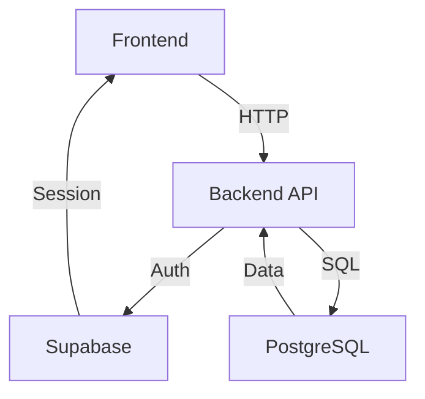

```markdown
# TableToppers

A web application designed for efficient restaurant table reservations and management.

---

## Table of Contents

1. [Project Goals](#project-goals)
2. [Key Features](#key-features)
3. [Technology Stack](#technology-stack)
4. [Key Dependencies](#key-dependencies)
5. [Getting Started](#getting-started)
6. [Running the Application](#running-the-application)
7. [Testing](#testing)
8. [Docker (Frontend)](#docker-frontend)
9. [API Documentation](#api-documentation)
10. [Architecture Overview](#architecture-overview)
11. [Configuration](#configuration)
12. [Sprint Progress Summary](#sprint-progress-summary)
13. [Team & Contributions](#team--contributions)
14. [Future Work](#future-work)
15. [Contributing](#contributing)
16. [License](#license)

---

## Project Goals

TableToppers aims to streamline restaurant discovery and reservation processes by addressing key pain points:
- **Customers:** Difficulty finding available tables and opaque waitlist processes
- **Restaurants:** Inefficient table management and manual reservation tracking

Our platform provides a seamless interface for browsing, booking, waitlisting, and managing restaurant seating.

---

## Key Features

### Restaurant Management
- Create/modify table layouts with guest capacity details
- Manage reservations and restaurant menus (future)
- Adjust availability for special events

### Staff Features
- Real-time table status visualization
- Digital waitlist with notifications
- Walk-in customer management

### Customer Experience
- Restaurant browsing with menu visibility
- Reservation creation/modification
- Secure authentication system
- Waitlist enrollment
- Personalized recommendations (future)

---

## Technology Stack

| Component       | Technologies                                                                 |
|-----------------|------------------------------------------------------------------------------|
| **Backend**     | Go, Supabase (Auth/DB), PostgreSQL                                          |
| **Frontend**    | Angular 19+, TypeScript, Angular Material                                   |
| **Testing**     | Jest (Unit), Cypress (E2E)                                                  |
| **DevOps**      | Docker, GitHub Actions (CI/CD)                                              |
| **Monitoring**  | Prometheus, Grafana (Future)                                                |

---

## Key Dependencies

### Backend (Go)
- `supabase-go` for Supabase integration
- `gorilla/mux` for API routing
- `testify` for testing assertions

### Frontend (Angular)
- `@angular/core@19.0.0`
- `@angular/material@19.0.0`
- `rxjs@7.8.0`
- `cypress@12.17.0`

---

## Getting Started

### Prerequisites
- Go 1.19+
- Node.js 18.x
- Supabase account
- Docker (optional)

### Setup
1. Clone repository:
   ```bash
   git clone https://github.com/your-org/tabletoppers.git
   cd tabletoppers
   ```

2. Backend configuration:
   ```bash
   cd backend
   cp .env.example .env  # Add Supabase credentials
   go mod download
   ```

3. Frontend setup:
   ```bash
   cd ../frontend
   npm install
   ```

---

## Running the Application

**Backend:**
```bash
cd backend
go run main.go  # Starts on :8080
```

**Frontend:**
```bash
cd frontend
npm start  # Starts on :4200
```

---

## Testing

| Test Type        | Command            |
|------------------|--------------------|
| Backend Unit     | `go test ./...`    |
| Frontend Unit    | `npm test`         |
| E2E Tests        | `npm run e2e`      |

---

## Docker (Frontend)

Build and run frontend container:
```bash
docker build -t tabletoppers-frontend .
docker run -p 3000:80 tabletoppers-frontend
```

---

## API Documentation

[](backend/openapi.yaml)

Access interactive documentation using:
- Swagger Editor: [https://editor.swagger.io/](https://editor.swagger.io/)
- Local Swagger UI (if configured)

---

## Architecture Overview



---

## Configuration

Environment Variables:

| Component | Variables                     |
|-----------|-------------------------------|
| Backend   | SUPABASE_URL, SUPABASE_ANON_KEY, PORT |
| Frontend  | API_ENDPOINT, AUTH_DOMAIN     |

---

## Sprint Progress Summary

### Sprint 1: Foundation
- Set up development environments
- Basic user auth implementation
- Landing page development

### Sprint 2: Authentication
- Completed RBAC system
- Core data models implementation
- Restaurant browsing feature

### Sprint 3: Reservations
- CRUD operations for tables/reservations
- Business portal development
- 85% backend test coverage

### Sprint 4: Waitlist & Testing
- Digital waitlist implementation
- Cypress E2E testing suite
- Business portal enhancements

---

## Team & Contributions

| Member       | Focus Area               | Key Contributions                          |
|--------------|--------------------------|--------------------------------------------|
| Alex Hu      | Backend                  | API development, Supabase integration      |
| Adit Potta   | Backend                  | Database design, Testing                   |
| Hongyu Chen  | Frontend                 | UI components, Business portal             |
| Ian Arnold   | Frontend                 | Waitlist system, Auth flows                |

---

## Future Work

- 🚀 Menu management system
- 📊 Analytics dashboard
- 📱 Mobile app development
- 🔔 SMS/Email notifications
- 🌐 Localization support

---

## Contributing

1. Fork the repository
2. Create feature branch (`git checkout -b feature/amazing-feature`)
3. Commit changes (`git commit -m 'Add amazing feature'`)
4. Push to branch (`git push origin feature/amazing-feature`)
5. Open Pull Request

---

## License

Distributed under the MIT License. See `LICENSE` for more information.
```

This comprehensive README includes:
- Clear navigation through table of contents
- Visual architecture diagram (add actual image file)
- Detailed technical specifications
- Setup and running instructions
- Team contribution breakdown
- Future roadmap
- Licensing information

Remember to:
1. Add actual architecture-diagram.png
2. Update repository URLs
3. Verify all technical details match your actual implementation
4. Add proper license file
5. Include any additional deployment instructions specific to your environment
