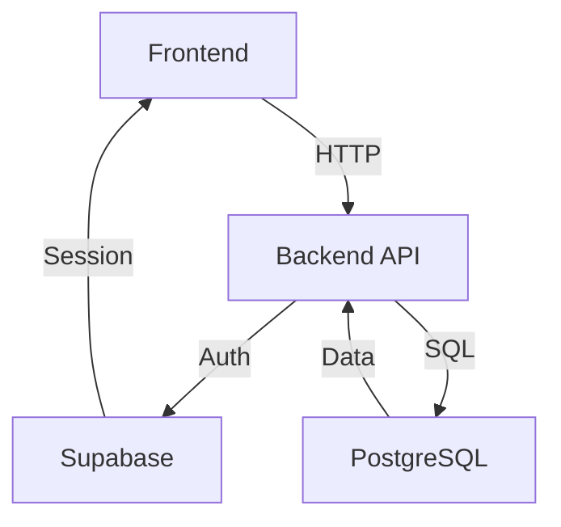

````markdown
# TableToppers

A web application designed for efficient restaurant table reservations and management.

---

## Table of Contents

1. [Project Goals](#project-goals)
2. [Key Features](#key-features)
3. [Technology Stack](#technology-stack)
4. [Key Dependencies](#key-dependencies)
5. [Getting Started](#getting-started)
6. [Running the Application](#running-the-application)
7. [Testing](#testing)
8. [Docker (Frontend)](#docker-frontend)
9. [API Documentation](#api-documentation)
10. [User Stories & Acceptance Criteria](#user-stories--acceptance-criteria)
11. [Architecture Overview](#architecture-overview)
12. [Configuration](#configuration)
13. [Sprint Progress Summary](#sprint-progress-summary)
14. [Team & Contributions](#team--contributions)
15. [Future Work](#future-work)
16. [Contributing](#contributing)
17. [License](#license)

---

## Project Goals

TableToppers aims to streamline restaurant discovery and reservation processes by addressing key pain points:
- **Customers:** Difficulty finding available tables and opaque waitlist processes
- **Restaurants:** Inefficient table management and manual reservation tracking

Our platform provides a seamless interface for Browse, booking, waitlisting, and managing restaurant seating.

---

## Key Features

### Restaurant Management
- Create/modify table layouts with guest capacity details
- Manage reservations and restaurant menus (future)
- Adjust availability for special events

### Staff Features
- Real-time table status visualization
- Digital waitlist with notifications
- Walk-in customer management

### Customer Experience
- Restaurant Browse with menu visibility
- Reservation creation/modification
- Secure authentication system
- Waitlist enrollment
- Personalized recommendations (future)

---

## Technology Stack

| Component       | Technologies                                                                 |
|-----------------|------------------------------------------------------------------------------|
| **Backend** | Go, Supabase (Auth/DB), PostgreSQL                                           |
| **Frontend** | Angular 19+, TypeScript, Angular Material                                  |
| **Testing** | Jest (Unit), Cypress (E2E)                                                   |
| **DevOps** | Docker, GitHub Actions (CI/CD)                                               |
| **Monitoring** | Prometheus, Grafana (Future)                                                 |

---

## Key Dependencies

### Backend (Go)
- `supabase-go` for Supabase integration
- `gorilla/mux` for API routing
- `testify` for testing assertions

### Frontend (Angular)
- `@angular/core@19.0.0`
- `@angular/material@19.0.0`
- `rxjs@7.8.0`
- `cypress@12.17.0`

---

## Getting Started

### Prerequisites
- Go 1.19+
- Node.js 18.x
- Supabase account
- Docker (optional)

### Setup
1. Clone repository:
   ```bash
   git clone [https://github.com/your-org/tabletoppers.git](https://github.com/your-org/tabletoppers.git)
   cd tabletoppers
````

2.  Backend configuration:

    ```bash
    cd backend
    cp .env.example .env  # Add Supabase credentials
    go mod download
    ```

3.  Frontend setup:

    ```bash
    cd ../frontend
    npm install
    ```

-----

## Running the Application

**Backend:**

```bash
cd backend
go run main.go  # Starts on :8080
```

**Frontend:**

```bash
cd frontend
npm start  # Starts on :4200
```

-----

## Testing

| Test Type        | Command             |
|------------------|---------------------|
| Backend Unit     | `go test ./...`     |
| Frontend Unit    | `npm test`          |
| E2E Tests        | `npm run e2e`       |

-----

## Docker (Frontend)

Build and run frontend container:

```bash
docker build -t tabletoppers-frontend .
docker run -p 3000:80 tabletoppers-frontend
```

-----

## API Documentation

[](https://www.google.com/search?q=backend/openapi.yaml)

Access interactive documentation using:

  - Swagger Editor: [https://editor.swagger.io/](https://editor.swagger.io/)
  - Local Swagger UI (if configured)

-----

## User Stories & Acceptance Criteria

### Register a New User

**User Story:**
As a new customer, I want to create an account so that I can securely access the application’s features.

**Acceptance Criteria:**

  - I must provide all required fields (username, password, email, phone number, first name, last name).

### Login for Existing User

**User Story:**
As an existing user (customer/staff/manager/admin), I want to log in so that I can securely access my account and the relevant system features.

**Acceptance Criteria:**

  - I must provide valid credentials (username/password/timestamp).
  - Set up authentication on sign in.
  - Proper error handling and validation should be implemented.

### Retrieve a List of Restaurants

**User Story (Customer):**
As a customer, I want to browse through a list of restaurants so that I can pick where I’d like to dine or reserve a table.

**User Story (Restaurant Manager/Staff):**
As a restaurant manager or staff, I want to retrieve only the restaurants under my management (or all if I’m an admin) so that I can oversee them.

**Acceptance Criteria:**

  - I can optionally filter restaurants by city or name.

### Join a Waitlist

**User Story:**
As a customer, I want to be able to enter a waitlist for reservations if the restaurant is fully booked, so that I have a chance to get a table in case of cancellations.

**Acceptance Criteria:**

  - If a restaurant is fully booked for a given time slot, I can join a waitlist.
  - If I am next in line and a table opens, I have a limited time to confirm the reservation before it is offered to the next person.

### Create a New Restaurant

**User Story:**
As a manager (or admin), I want to add a new restaurant to the system so that I can start managing it.

**Acceptance Criteria:**

  - I must provide valid restaurant data (name, location, etc.).

### Get All Tables for a Restaurant

**User Story:**
As a restaurant staff or a manager, I want to see all the tables for a specific restaurant so that I can manage seating and table availability.

**Acceptance Criteria:**

  - I must provide the restaurant Id.

### Create a New Table

**User Story:**
As a manager or staff, I want to add a new table to a restaurant so that I can increase seating capacity or reorganize the layout.

**Acceptance Criteria:**

  - I must provide the required fields (min capacity, max capacity) in the request body.

### Create a New Reservation

**User Story (Customer):**
As a customer, I want to make a reservation for a specific restaurant so that I can secure a table in advance.

**Acceptance Criteria:**

  - I must provide reservation time, number of guests, and phone number.

### Get All Reservations for a Restaurant

**User Story (Staff/Manager):**
As restaurant staff or a manager, I want to see all reservations for a restaurant to manage seat assignments and scheduling.

**Acceptance Criteria:**

  - I must provide the restaurant Id.
  - I can optionally filter by date (query parameter).

### Get a Single Reservation

**User Story (Staff/Manager/Customer who made it):**
As the reservation owner or restaurant staff/manager, I want to view the details of a specific reservation so that I can confirm the reservation or see the booking information.

### Landing Page Development

**User Story:**
As a visitor, I want to see a welcoming landing page so that I can learn about the different restaurants.

**Acceptance Criteria:**

  - Basic navigation for other sections of the site.
  - The page should be optimized for mobile users.

### Backend Environment Setup

**User Story:**
As a developer, setup the environment for frontend.

**Acceptance Criteria:**

  - Setup of Node, VS Code, Angular CLI, Git setup/Sourcetree.

-----

## Architecture Overview



*(Note: Replace the mermaid code block above with an actual `architecture-diagram.png` file if available)*

-----

## Configuration

Environment Variables:

| Component | Variables                     |
|-----------|-------------------------------|
| Backend   | SUPABASE\_URL, SUPABASE\_ANON\_KEY, PORT |
| Frontend  | API\_ENDPOINT, AUTH\_DOMAIN     |

-----

## Sprint Progress Summary

### Sprint 1: Foundation

  - Set up development environments
  - Basic user auth implementation
  - Landing page development

### Sprint 2: Authentication

  - Completed RBAC system
  - Core data models implementation
  - Restaurant Browse feature

### Sprint 3: Reservations

  - CRUD operations for tables/reservations
  - Business portal development
  - 85% backend test coverage

### Sprint 4: Waitlist & Testing

  - Digital waitlist implementation
  - Cypress E2E testing suite
  - Business portal enhancements

-----

## Team & Contributions

| Member       | Focus Area               | Key Contributions                      |
|--------------|--------------------------|----------------------------------------|
| Alex Hu      | Backend                  | API development, Supabase integration  |
| Adit Potta   | Backend                  | Database design, Testing               |
| Hongyu Chen  | Frontend                 | UI components, Business portal         |
| Ian Arnold   | Frontend                 | Waitlist system, Auth flows            |

-----

## Future Work

  - 🚀 Menu management system
  - 📊 Analytics dashboard
  - 📱 Mobile app development
  - 🔔 SMS/Email notifications
  - 🌐 Localization support

-----

## Contributing

1.  Fork the repository
2.  Create feature branch (`git checkout -b feature/amazing-feature`)
3.  Commit changes (`git commit -m 'Add amazing feature'`)
4.  Push to branch (`git push origin feature/amazing-feature`)
5.  Open Pull Request

-----

## License

Distributed under the MIT License. See `LICENSE` for more information.

-----

**Remember to:**

1.  Add an actual architecture-diagram.png or ensure the Mermaid diagram renders correctly in your environment.
2.  Update repository URLs (e.g., `https://github.com/your-org/tabletoppers.git`).
3.  Verify all technical details match your actual implementation.
4.  Add a proper `LICENSE` file to the repository.
5.  Include any additional deployment instructions specific to your environment if necessary.

<!-- end list -->

```
```
